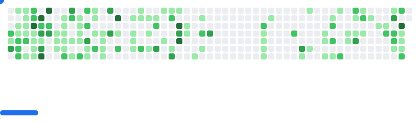

<!--horizontal divider(gradiant)-->

<!--h1 without bottom border-->

  <ul align="center">
    
<h1 style="display: inline-block">Hello, I´m Mateo! 👋</h1>

  </ul>

  <ul align="center">
    
<h1 style="display: inline-block"><picture></picture> About me</h1>

    <picture> </picture>
  </ul>

- 🎓 I am currently in my **final year of Software Development Technology** at the [Fundación Universitaria Tecnológica de Comfenalco](https://tecnologicocomfenalco.edu.co/).
- 🧠 Certified as an **[AWS Solutions Architect - Certified Associate (SAA-C03)](https://www.credly.com/badges/2abde7f4-c398-44b1-83a1-7e6716ae8387/public_url)**.
- 🔭 I focus on developing **back-end web applications with scalable, robust, and high-performance architectures**.
- 💡 Focused on creating clean, quality code.
- 🌱 I am proficient in backend areas such as **Java, Spring Boot, and Spring Cloud**
- 🧪 I am deeply committed to delivering high-quality code through thorough testing and effective simulations.
  - Backend: Unit and integration testing with [JUnit 5](https://junit.org/) and [Mockito](https://site.mockito.org/).
  - Frontend: Modern testing environments using [Vitest](https://vitest.dev/) and [React Testing Library](https://testing-library.com/docs/react-testing-library/intro/).
- ☁️ Passionate about **cloud computing**, microservices architecture, and modern DevOps.
- 💻 I have developed full-stack applications from solution analysis to production.
- 🐋 I am comfortable with Docker containers and images for local development and deployments.
- 🛡️ I understand and apply secure authentication flows such as **JWT**, **OAuth2**, and **OpenID Connect**.
- 📫 **[Contact me](mateo204r@gmail.com)**

<picture class="picture">
  <source media="(prefers-color-scheme: dark)" srcset="images/breakout-dark.svg">
  <source media="(prefers-color-scheme: light)" srcset="images/breakout-light.svg">
  
</picture>

  <ul align="center">
    
<h1 style="display: inline-block">⚙️ GitHub Analytics</h1>

  </ul>

<table align="center">
  <tr>
    <td align="center" style="width: 50%; min-width: 300px;">
      
        
      
    </td>

  <td align="center" style="width: 50%; min-width: 300px;">
      
    </td>
  </tr>
</table>

  <ul align="center">
    
<h2 style="display: inline-block">Skills👨🏻‍💻</h2>

  </ul>

  

  <ul align="center">
    
<h2 style="display: inline-block">Connect With Me🤝</h2>

  </ul>

 &nbsp;&nbsp;

 &nbsp;&nbsp;

