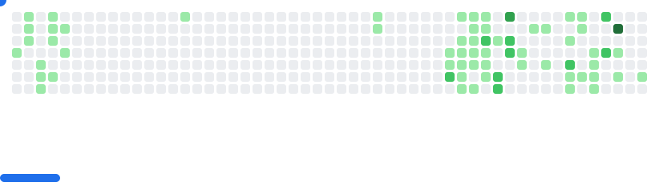

<!--horizontal divider(gradiant)-->

<!--h1 without bottom border-->

  <ul align="center">
    
<h1 style="display: inline-block">Hello, I´m Mateo! 👋</h1>

  </ul>

  <ul align="center">
    
<h1 style="display: inline-block"><picture></picture> About me</h1>

    <picture> </picture>
  </ul>

- 🎓 I am currently in my **final year of Software Development Technology** at the [Fundación Universitaria Tecnológica de Comfenalco](https://tecnologicocomfenalco.edu.co/).
- 🧠 Certified as an **AWS Solutions Architect - Certified Associate (SAA-C03)**.
- 🔭 I focus on developing **back-end web applications with scalable, robust, and high-performance architectures**.
- 💡 Focused on creating clean, quality code.
- 🌱 I am proficient in backend areas such as **Java, Spring Boot, and Spring Cloud**
- ☁️ Passionate about **cloud computing**, microservices architecture, and modern DevOps.
- 💻 I have developed full-stack applications from solution analysis to production.
- 🐋 I am comfortable with Docker containers and images for local development and deployments.
- 🛡️ I understand and apply secure authentication flows such as **JWT**, **OAuth2**, and **OpenID Connect**.
- 📫 **[Contact me](mateo204r@gmail.com)**

<picture class="picture">
  <source media="(prefers-color-scheme: dark)" srcset="images/breakout-dark.svg">
  <source media="(prefers-color-scheme: light)" srcset="images/breakout-light.svg">
  
</picture>

  <ul align="center">
    
<h1 style="display: inline-block">⚙️ GitHub Analitycs </h1>

  </ul>

<!--- stats & Trophy (start) -->

  <!--- stats (start) -->
<table align="center">
<tr border="none">
<td width="50%" align="center">
  
  
</td>
<td width="50%" align="center">
  
  </td>
</tr>
</table>

  <ul align="center">
    
<h2 style="display: inline-block">Skills👨🏻‍💻</h2>

  </ul>

  

  <ul align="center">
    
<h2 style="display: inline-block">Connect With Me🤝</h2>

  </ul>

 &nbsp;&nbsp;

 &nbsp;&nbsp;

